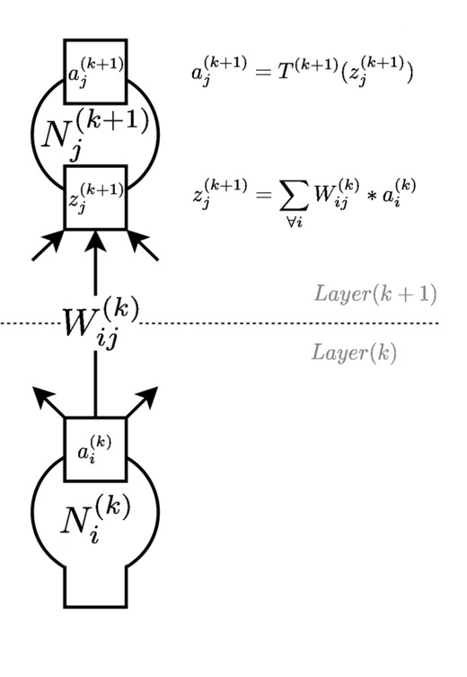
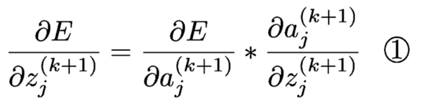
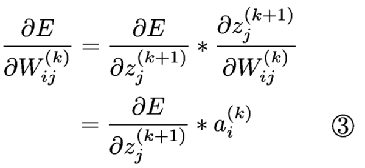

# Maths of Backpropagation

The following diagrams and equations describe backprop algorithm using similar names for things as the code in
RuNeNe. I have found it more instructive to study the maths behind backprop than any number of
implementations or pseudo-code. I think this is because the algorithm is often over-simplified in practice
due to clever choices of transfer functions, so it is not at all clear why certain values are
used or re-used in code loops, or what needs to change if for example you want to use a different
objective function or transfer function.

If you find maths equations with summations and partial derivatives in them daunting, then you are
not alone. However, their use in backprop is not at all advanced. The hardest thing is keeping
track of which variable is which. Most of the "decoration" of i, j, and k's is to identify
which specific item in which layer is being considered. To avoid the "wall of symbols" effect, I
suggest just take a little time to read and re-read the equations.

The notes below do not explain the full derivation of the equations. There are other resources
online available for that. The main part of the derivation is repeated application of the *Chain Rule*.

## Terms

### Values

 * **a** is the activation or output value for a neuron.
 * **z** is the pre-activation value (sometimes called the "logit"), calculated by summing all the inputs times weights that feed into a neuron.
 * **T** is the transfer function that connects a with z, i.e. ```a = T(z)```.
 * **W** is the weight, or strength of connection between two neurons.
 * **E** is an error value that measures difference between desired outputs (from training examples) and actual outputs (from running those same examples through the network).
 * **N** is a label for a neuron. It is not really used in RuNeNe, but is sometimes a useful label for reference.

### Indices

 * **k** is an index to the layer in the overall network. I use **(k)** and **(k+1)** superscripts to identify which layer an entity is the property of when the logic connects more than one layer.
 * **i** is an index to each neuron in a lower **(k)** layer. The upside-down "A" that goes with it in one equation means "for all..." i.e. sum over all **i** - this avoids needing to define total numbers of neurons in each layer with yet more symbols.
 * **j** is an index to each neuron in an upper **(k+1)** layer.

## Section of feed-forward network

This shows a two connected neurons, one example from each layer, and the equations used to run the
network forward to outputs. The layer **(k)** is one where you already know the activations, and the
layer **(k+1)** is one where you want to calculate them.



Note the sum over all **i** includes a *bias* term. The bias can be thought of as a neuron
in layer **(k)** with an activation always set to 1. Inside RuNeNe, the weights associated with the bias are stored as the
last column of the weights matrix. Other libraries may have it handled differently - other common options are
as the first column, or as a separate vector of weights in each layer.

## Backpropagation equations

The equations below describe how to calculate the value of gradients to the objective function with respect
to the free parameters of the neural network. The
goal is to calculate the gradient of the function with respect to neural network parameters that change
with training. Usually that is the weights between neurons, but in more complex networks it can include
parameters to transfer functions or starting values for internal state.

To start the process, the network is assessed against a training example, and a value obtained for
the objective function. Then the partial derivative of the objective or error value with respect to
the output layer activations is needed:


 Where **kmax** is the highest value of **k** . . . this has to be calculated based on the form of the objective function.
 Once we have this value,
 then it allows us to calculate gradients of the objective function with respect to other parameters
 in the network, in a series of three repeated steps, starting with **k = kmax -1** and repeating
 all three steps whilst reduing **k** until it represents the input layer (in RuNeNe, **k** is
 zero-indexed, so input layer is layer 0)



This result from equation 1 is used as a term in equations 2 and 3.


The result from equation 2 can be used to propagate the gradients further down the network. It feeds
back into equation 1 for the next layer down. In this equation, bias terms are ignored (i.e. they do
not propagate further, and the bias activation value of 1 is not allowed to vary so calculating the gradient of
error with respect to it is not important).



The result from equation 3 is typically accumulated across a number of examples (called a mini-batch)
and then used to alter the existing weights. In the simplest form of gradient descent, a small factor of
the gradient is subtracted from the current weight values.

In equation 3, gradients of weights to bias inputs are included.
